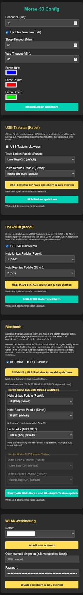

**Adapter Configuration**
There is a possibility to configure this adpater via an web frontend (wifi)
If the adapter is freshly flashed you have to find it inside your wireless environment.
Default SSID is "Morse-S3-Config", you don't need a password.
Once you are connected to the device you can reach the configuration page via Webbrowser (e.g. Firefox..) at http://192.168.4.1

As an first step its a good idea to connect the adapter to your home network. Therefore scroll down, click to "Wlan scannen", Go to "Netze:" and select you home network. Finally enter your network password and click "WLAN speichern & neu starten"

 
[← back to table of contents](README.md)
